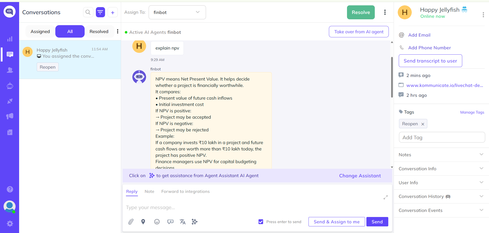
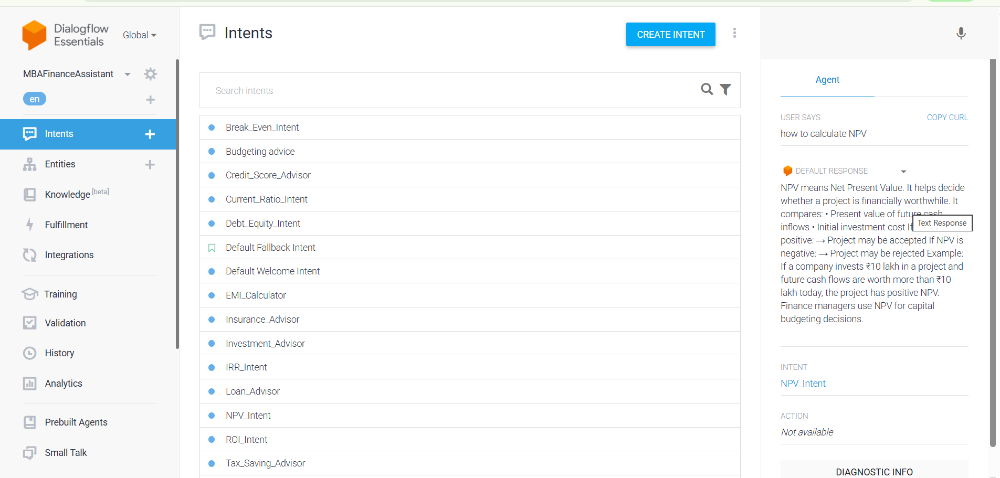
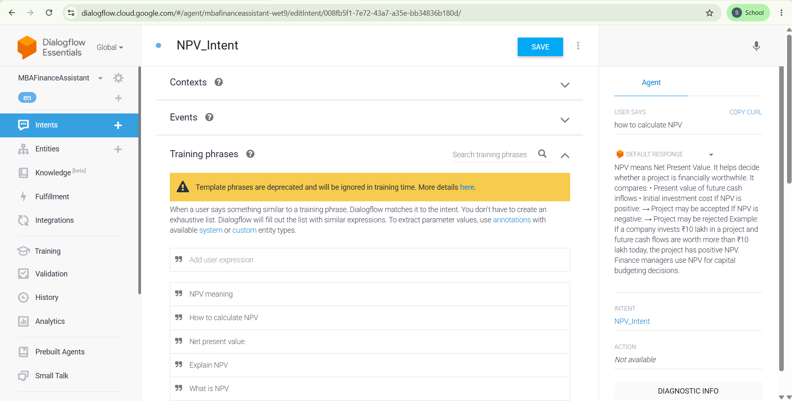
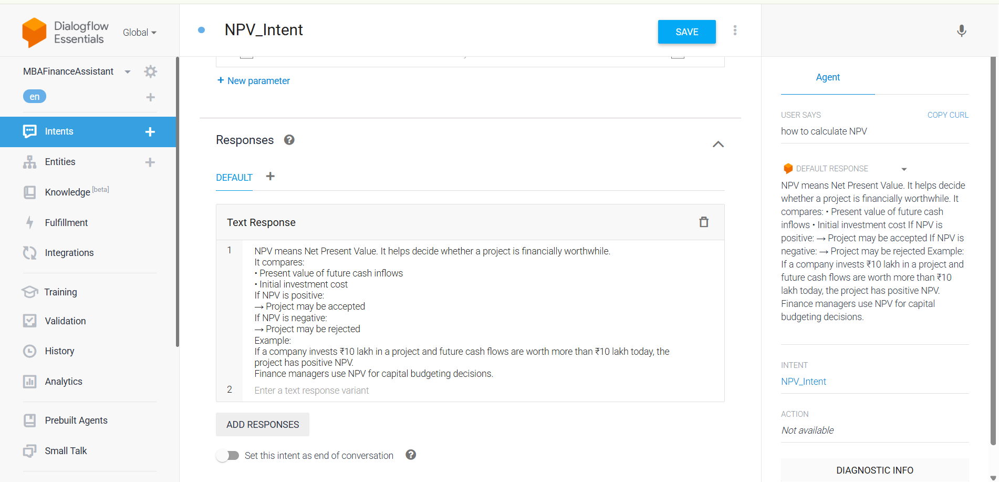
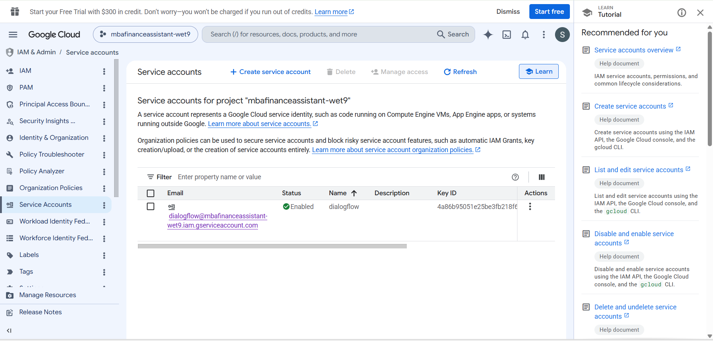
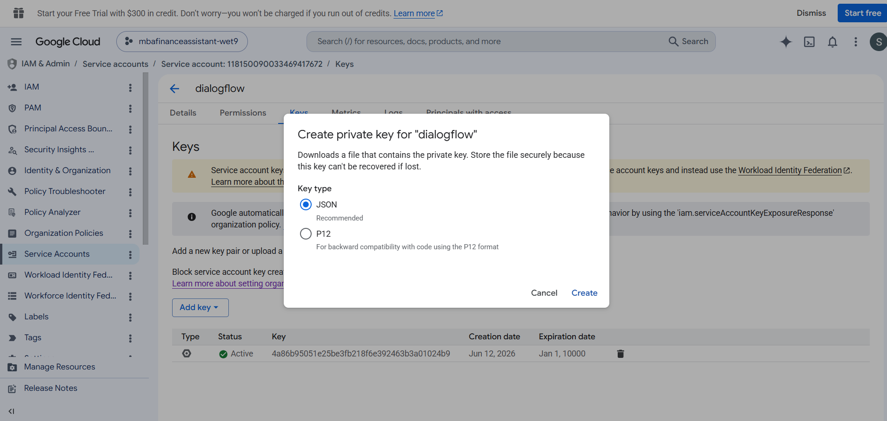
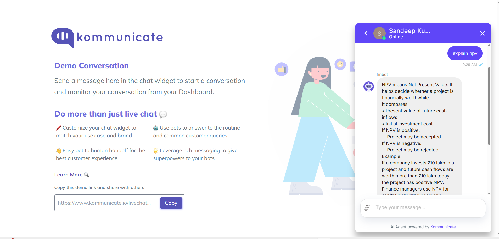

# MBA Finance Assistant Chatbot

An intelligent, conversational AI assistant designed to help management students and finance professionals with core financial concepts like Net Present Value (NPV), Internal Rate of Return (IRR), break-even analysis, and investment advice. 

This chatbot is built using **Google Dialogflow Essentials (ES)** for Natural Language Understanding (NLU) and seamlessly integrated into a live website widget via **Kommunicate.io**.

---

## 🚀 Features & Architecture
* **Natural Language Processing:** Built using Dialogflow intents and training phrases to handle varying user queries.
* **Financial Logic Coverage:** Features intents for NPV calculation, IRR, Loan Advisory, and Tax Saving.
* **Live Chat Widget:** Deployed using Kommunicate for real-time customer/user support simulation.
* **Secure Cloud Integration:** Built-in Google Cloud IAM service account configurations for production scalability.

---

## 📸 Project Walkthrough & Implementation

### 1. Dialogflow Agent & Intent Configurations
The foundation of the chatbot starts with configuring the NLU platform inside Google Dialogflow.

#### Agent Creation & Settings
The global settings, project ID verification (`mbafinanceassistant-wet9`), time zone adjustments, and general configurations for the core agent.

#### Intent Architecture List
A structural view of all built-in intents handling various financial tasks like `Break_Even_Intent`, `Current_Ratio_Intent`, and `NPV_Intent`.

#### Training Phrases Setup (NPV Intent)
Fine-tuning the chatbot to recognize user intent. Multiple variations of phrases like *"What is NPV"* and *"How to calculate NPV"* are mapped out.

#### Static & Dynamic Responses
Crafting the definitive text responses that explain complex financial metrics simply to the end-user.

---

### 2. Google Cloud Integration & Authentication
To securely bridge Dialogflow with customer service platforms or custom web webhooks, IAM credentials must be generated.

#### Service Account Creation
The creation of the dedicated Google Cloud service account running for the `mbafinanceassistant-wet9` project.

#### Generating the JSON Private Key
Downloading the private JSON credentials key used to authorize third-party platforms to communicate with our Dialogflow agent securely.

---

### 3. Deployment via Kommunicate
The assistant is deployed into production by syncing the Dialogflow agent credentials into a live conversational interface.

#### Kommunicate AI Agent Setup
Connecting the Dialogflow NLU backend engine into the Kommunicate dashboard engine (`finbot`).

#### Live Chat Interface & End-User Experience
The final working product! A clean demo conversation showing a user asking to *"explain npv"* and receiving a well-structured financial breakdown natively inside the chat widget.

*Note: You can use your live widget simulation screenshots here to prove final deployment.*

---

## 🛠️ Tech Stack
* **Conversational AI Platform:** Google Dialogflow ES
* **Deployment & Integration Widget:** Kommunicate.io
* **Cloud Infrastructure & Security:** Google Cloud Platform (GCP) IAM

## 📂 How to Run Locally / Replicate
1. Clone this repository.
2. Export the `.zip` agent file from Dialogflow and import it into your own console.
3. Generate your service account `JSON credentials key` from GCP.
4. Paste the JSON key inside your **Kommunicate > Bot Integrations** section to link your bot instantly!
